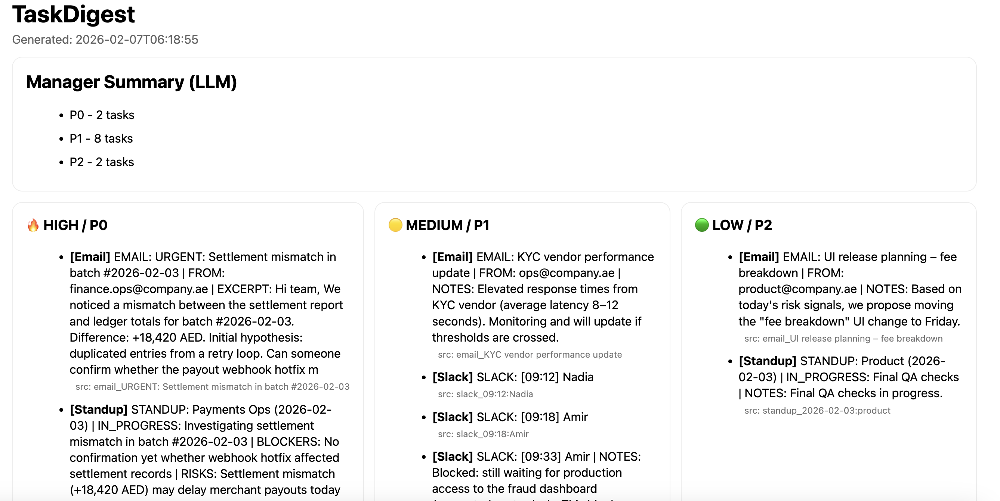

# TaskDigest

TaskDigest converts noisy operational inputs (Emails, Slack logs, Standups) into a **clear, manager-ready daily report** with **deterministic P0 / P1 / P2 priorities**, visible risks, and full auditability — **running fully locally**.

The goal is simple:  
**understand the operational situation in seconds, not by reading threads.**

---

## What problem it solves

In real operations:

- Critical risks are buried inside long email threads
- Slack discussions require full context to understand decisions
- Standups repeat the same blockers every day
- After vacation or context switch, onboarding is slow and painful

**Result:** missed risks, delayed decisions, cognitive overload.

A sample report is available in `outputs_demo/report.html`




---

## Install

```
chmod +x install.sh
./install.sh
source .venv/bin/activate

```

Оllama (If Ollama was installed via install.sh, the model is already pulled)
```
ollama serve
ollama pull phi3:mini 
```

Requirements:
```
Python 3.9+

macOS or Linux
(Windows: WSL recommended)
```

## Run

1) With local LLM (Ollama)

No API keys. Everything runs locally.

#Run with local Ollama LLM (extended timeout for slow/cold-start models)
```
python main.py --input inputs_demo --output outputs --llm ollama --timeout 120 --extract-timeout 120
```

#Run with local Ollama LLM
```
python main.py --input inputs_demo --output outputs --llm ollama
```

2) Fully deterministic (no AI)

```
python main.py \
  --input inputs_demo \
  --output outputs \
  --llm none
```

## Output

After running, TaskDigest generates:

```
outputs/
├── report.md          # compact manager-readable report
├── report.html        # same content, visual layout
├── report.json        # structured report
├── items.json         # all extracted items (before grouping)
├── standups.json      # parsed standup events (debug / audit)
├── slack_events.json  # parsed slack events (debug / audit)
└── email_events.json  # parsed email events (debug / audit)
```


## How TaskDigest works

Event-aware parsing

TaskDigest detects input type by content, not filename.

Emails

-Split by Subject:

-Chunk long bodies

-LLM extracts signals from chunks

-One aggregated item per email thread

Slack logs

-Split by ---

-Root message detected as [HH:MM] Name:

-Replies kept as context

-One aggregated item per Slack event

Standups

-Split by STANDUP:

-Sections parsed deterministically

-LLM adds optional context

-One aggregated item per standup

There are no separate Slack / Email / Standup sections in the report.
Everything is merged into P0 / P1 / P2.

Report structure
Manager Summary


Priority columns

🔥 P0 / HIGH — critical

🟡 P1 / MEDIUM — needs attention

🟢 P2 / LOW — informational


Each item includes:

- short human-readable description

- channel (Email / Slack / Standup / Doc)

- source identifier (event-level or file:chunk)

- Priority logic (deterministic)

Priority is assigned by explicit policy rules, not by AI.

P0 — Critical

- Settlement / ledger mismatches

- Financial risk with urgency (EOD, delay today)

- Payment pipeline incidents

P1 — Medium

- SLA degradation

- Fraud / abuse signals

- Investigations blocked by missing access

- P2 — Low

- Planning and coordination

- Informational updates

- Routine execution

LLM suggestions can never downgrade policy priority.

## Key principles

1) LLM is used for synthesis, not decisions

LLM extracts signals from raw text

All prioritization is deterministic

System remains correct even if AI fails

2) Graceful degradation

--llm none → fully deterministic pipeline

--llm ollama → adds extraction hints

Same outputs, same structure

3) Traceability by design

Doc inputs keep file:chunk_id sources

Slack / Email / Standups produce one item per event

Raw event text is preserved in debug JSON outputs

4) Privacy-first

Runs locally

No API keys

No data leaves your machine

Supported inputs

Plain files only — no integrations required.

Supported formats:
```
.txt

.md

.json
```
Example:
```
inputs_demo/
├── emails.txt
├── slack.txt
└── standups.txt
```

## Who this is for

- Operations & incident managers

- Risk & compliance teams

- Product & platform leads

- Workflow automation pipelines
```

## Roadmap

- Wire LLM-generated manager summary into report

- Slack / Email API connectors

- Incremental daily runs

- Owner assignment & follow-ups

- Policy customization per company